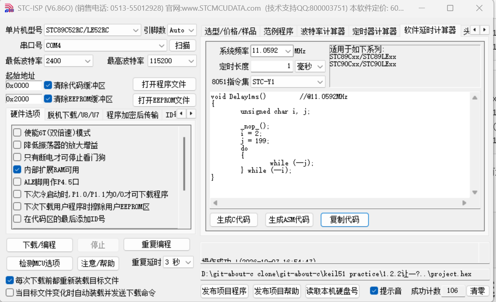

# 2026-10-7位运算和延时函数改写

## 一.位运算

| 运算符 | 名称     | 规则                                | 简单用途                     |
| ------ | -------- | ----------------------------------- | ---------------------------- |
| `&`    | 按位与   | 两个位都为 1，结果才为 1            | 取某几位、清零、判断奇偶     |
| `|`    | 按位或   | 只要有一个位为 1，结果就为 1        | 设置某几位为 1               |
| `^`    | 按位异或 | 两个位不同为 1，相同为 0            | 翻转位、校验、交换变量       |
| `~`    | 按位取反 | 0 变 1，1 变 0                      | 构造掩码、取反               |
| `<<`   | 左移     | 所有位向左移，右边补 0              | 相当于乘 `2^n`               |
| `>>`   | 右移     | 所有位向右移，左边补什么看类型/语言 | 相当于除 `2^n`，但负数要注意 |

设：

text

```
a = 12 = 0000 1100
b = 10 = 0000 1010
```

运算结果：

text

```
a & b  = 0000 1000 = 8
a | b  = 0000 1110 = 14
a ^ b  = 0000 0110 = 6
~a     = 1111 0011 = 243   // 按 8 位无符号看
```

如果按**有符号补码**看：

text

```
~a = -a - 1
~12 = -13
```

移位：

text

```
a << 1 = 0001 1000 = 24     // 12 * 2
a >> 1 = 0000 0110 = 6      // 12 / 2
```

```
x & 1          // 判断奇偶：1 是奇数，0 是偶数
x & 0xFF       // 取低 8 位
x | (1 << n)   // 把第 n 位置 1
x & ~(1 << n)  // 把第 n 位清零
x ^ (1 << n)   // 翻转第 n 位
```

异或还有这些性质：

text

```
a ^ a = 0
a ^ 0 = a
a ^ b ^ a = b
```

## 二.延时函数改写



- 系统频率 
- 8051指令集为Y1

```.c
void Delay1ms()		//@11.0592MHz
{
	unsigned char i, j;

	_nop_();
	i = 2;
	j = 199;
	do
	{
		while (--j);
	} while (--i);
}
```

改写

```.c
void Delay1ms(unsigned int xms)		//@11.0592MHz
{
	unsigned char i, j;
	wile(xms--)//******************//
	{
     _nop_();
	i = 2;
	j = 199;
	do
	{
		while (--j);
	} while (--i);
	}
	
}
```

- 添加unsigned int xms变量

- 直接while（xms--）;也可while(1){_nop_();
  	i = 2;
  	j = 199;
  	do
  	{
  		while (--j);
  	} while (--i);

  ​	xms=xms-1;

  }