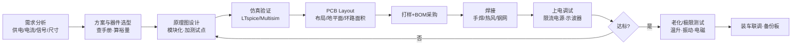
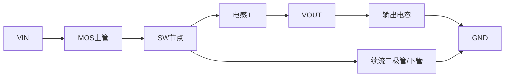
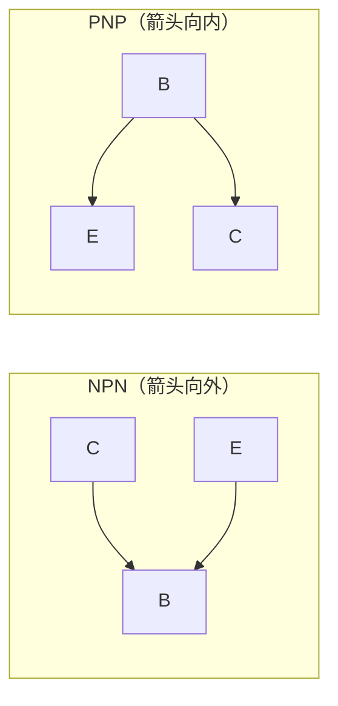
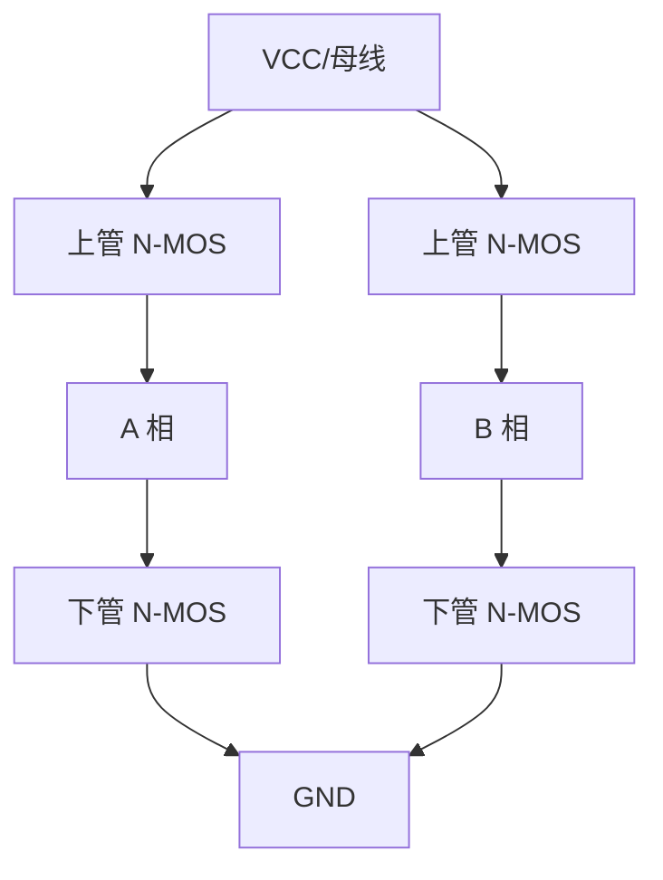

# 硬件基础笔记 · 从元器件到能看懂电路

> **这份笔记怎么用**
> 1. 每个器件按同一套模板走：**是什么 → 关键参数 → 典型电路 → 选型/计算 → 比赛里怎么用 → 踩坑点**。
> 2. 公式只记最常用的那几个，剩下的现场推或查手册。
> 3. 所有数值都是"典型值/量级"，**实际一定要查数据手册（Datasheet）**，不同厂家、不同系列差很多。
> 4. 看视频顺序建议：P1（第零讲，先搞清硬件在队伍里干什么）→ P2 电阻 → P3 电容电感 → P4 二极管 → P5 三极管/MOS管。

---

## 目录

- [0. 第零讲：硬件同学在竞赛队伍里到底干什么](#0-第零讲硬件同学在竞赛队伍里到底干什么)
- [1. 电阻](#1-电阻)
- [2. 电容](#2-电容)
- [3. 电感](#3-电感)
- [4. 二极管](#4-二极管)
- [5. 三极管（BJT）](#5-三极管bjt)
- [6. MOS管（MOSFET）](#6-mos管mosfet)
- [7. 五个器件的横向对比](#7-五个器件的横向对比)
- [附录 A：常用元件速查表](#附录-a常用元件速查表)
- [附录 B：去哪买、用什么软件、怎么练](#附录-b去哪买用什么软件怎么练)
- [附录 C：数据手册阅读清单与自检问题](#附录-c数据手册阅读清单与自检问题)

---

## 0. 第零讲：硬件同学在竞赛队伍里到底干什么

### 0.1 队伍里的分工

| 角色 | 负责什么 | 和硬件的关系 |
|---|---|---|
| 硬件 | 电源、驱动、采集调理、PCB、焊接、调试、电气安全 | 就是你自己 |
| 软件/嵌入式 | 单片机程序、控制算法、通信 | 硬件的"接口人"，要一起定接口 |
| 机械/结构 | 车体、机械臂、装配 | 决定板子尺寸、安装孔、走线空间 |
| 算法 | 视觉、路径规划 | 提出对算力和信号质量的要求 |

> 硬件不是"画完板子就完事"。一个硬件同学的真实工作量分布大约是：**需求与选型 20% → 原理图 20% → PCB 20% → 焊接/打样 10% → 调试与排故 30%**。调试才是主战场。

### 0.2 硬件方向的完整工作流



### 0.3 必备能力清单（大一可以照着补）

**工具类：**
- 万用表（通断、电压、电流、电阻、二极管档）——手要稳，先会量再会做
- 直流稳压电源（**必须会设限流**，这是保命技能）
- 示波器（探头 1×/10×、带宽、触发、看上升沿/纹波/毛刺）
- 电烙铁 + 热风枪 + 吸锡带（智能车板子全是 0603/0402，逃不掉）
- 信号发生器、电子负载、LCR 表（实验室一般都有）

**软件类：**
- EDA：嘉立创 EDA（免费、上手快）/ Altium Designer / KiCad
- 仿真：LTspice（免费、电源仿真强）、Multisim、TI-Tina
- 计算/查阅：立创商城、TI/ADI/ST 官网选型工具

**认知类（比工具更重要）：**
1. 会查数据手册，且**只看你需要的三五个参数**
2. 会算裕量：电压取 1.5~2 倍、电流取 1.5~2 倍、功率取 2 倍、温度留 20°C
3. 会"分而治之"排故：把电路切成模块，一级一级量
4. 会写实验记录：改了什么、量到什么、结论是什么

### 0.4 大一这一年建议的节奏

| 阶段 | 目标 | 产出 |
|---|---|---|
| 第 1~2 月 | 认元器件、会用万用表/烙铁、点灯 | 面包板小电路若干 |
| 第 3~4 月 | 学单片机 + 模电基础，能做最小系统板 | 一块能跑的 51/STM32 板 |
| 第 5~6 月 | 学电源（LDO+BUCK）、MOS 驱动、电机驱动 | 能驱动直流电机/舵机 |
| 第 7~9 月 | 完整项目：循迹小车 / 无线充电 / 电源题 | 一块自主设计的四层以内 PCB |
| 第 10~12 月 | 组队参赛、跟队做子系统 | 电赛/智能车校内赛经历 |

---

## 1. 电阻

### 1.1 一句话原理

电阻是**把电能不可逆地变成热**的元件，同时给电路提供"确定的关系"：限流、分压、取样、设点。

### 1.2 分类

| 类型 | 特点 | 典型用途 |
|---|---|---|
| 碳膜 | 便宜、精度差（±5%）、温漂大 | 对精度无要求的限流 |
| 金属膜 | ±1%、温漂小（50 ppm/°C 级） | 通用、分压、取样 |
| 金属氧化膜 | 耐高温、耐浪涌 | 电源里的小功率限流 |
| 绕线 | 功率大、电感大 | 大功率泄放、制动电阻 |
| 合金/康铜/锰铜 | 低温漂（±50 ppm/°C 以内）、低阻值 | **电流采样（毫欧级）** |
| 贴片厚膜 | 常用 1%、0.1% | 绝大多数板子 |
| 贴片薄膜 | 0.1%、低噪声 | 精密分压、基准 |
| 热敏/压敏/光敏 | 阻值随温度/电压/光照变化 | 测温、过压保护、光控 |
| 电位器/可调电阻 | 可调 | 调试时的临时调参（量产后要换成固定值） |

**封装常识（贴片）：** 数字表示英寸尺寸，前两位是长度、后两位是宽度。

| 封装 | 尺寸(mm) | 常见额定功率 | 备注 |
|---|---|---|---|
| 0201 | 0.6×0.3 | 1/20 W | 手机级，实验室少用 |
| 0402 | 1.0×0.5 | 1/16 W | 集成度高的板子 |
| 0603 | 1.6×0.8 | 1/10 W | **最通用，推荐新手** |
| 0805 | 2.0×1.25 | 1/8 W | 好焊，电流大一点 |
| 1206 | 3.2×1.6 | 1/4 W | 电源部分常用 |

> 注意：功率是按封装和散热条件给的，**同一封装在高温环境下要降额**（例如 70°C 以上按降额曲线打折），所以实际选型时功率至少留 2 倍裕量。

### 1.3 关键参数

1. **标称阻值**：E24（±5%，24 个值/十倍程）、E96（±1%，96 个值/十倍程）。所以"想要 1.05 kΩ"只能从标准值里挑最近的。
2. **精度（容差）**：±5% / ±1% / ±0.5% / ±0.1%。
3. **额定功率**：最常被忽略的参数。
4. **温度系数 TCR**：单位 ppm/°C。50 ppm/°C 表示温度变 50°C，阻值变 0.25%。**分压/采样电路里 TCR 不匹配会直接变成测量误差。**
5. **最大工作电压**：贴片电阻有耐压上限（0603 常为 75 V 左右），高压场合必须看这条。
6. **噪声**：薄膜 < 厚膜 < 碳膜。高增益小信号前级要注意。
7. **标称值读法**：`103` = 10×10³ = 10 kΩ，`4R7` = 4.7 Ω，`0R` / `000` = 0 Ω（跳线）。

### 1.4 五个必背典型电路

**(1) 分压**

$$V_{out} = V_{in}\cdot\frac{R_2}{R_1+R_2},\qquad I = \frac{V_{in}}{R_1+R_2}$$

- 分压的前提是"后级几乎不吃电流"（负载电流 ≪ 分压电流，一般要求 >10 倍）。
- 分压电流取 0.1~1 mA 比较折中：太小了怕干扰，太大了白耗电。
- **不要用电阻分压给器件供电**（负载一变电压就变），那是 LDO/DC-DC 的活。

**(2) 限流 / LED 限流**

$$R = \frac{V_{CC}-V_F}{I_F}$$

例：3.3 V 供红色 LED，$V_F\approx1.8\text{ V}$，想要 5 mA → $R=(3.3-1.8)/0.005=300\ \Omega$，取 330 Ω。

**(3) 上拉 / 下拉**

- 作用：给悬空引脚一个确定电平；开漏/开集输出必须有上拉才能输出高电平。
- 取值权衡：
  - 太大 → 边沿变慢（$RC$ 大）、抗干扰差、上升沿被电容拖垮
  - 太小 → 静态功耗大、灌电流可能超芯片限制
  - **I²C 常用 2.2 kΩ~10 kΩ**，总线速度快/线长时往下限取，省电场合往上限取
- 复位、使能、模式选择引脚**一定要加**，否则跑起来会"随机重启"这种玄学故障。

**(4) 基极限流（配合三极管）**

$$R_B \approx \frac{V_{IO}-V_{BE}}{I_B},\qquad I_B \ge (2\sim5)\cdot\frac{I_C}{h_{FE}}$$

- 取 2~5 倍余量是为了保证**深度饱和**，让 $V_{CE(sat)}$ 更小、发热更少。
- 例：驱动 100 mA 继电器，$h_{FE}$ 保守按 50 算 → $I_C/h_{FE}=2\text{ mA}$，取 5 倍 = 10 mA → $R_B=(3.3-0.7)/0.01=260\ \Omega$，取 220~270 Ω。

**(5) 电流采样（分流电阻 Shunt）**

$$V_{sense}=I\cdot R_{shunt}$$

- 取值原则：**压降够 ADC 分辨**，又**别浪费功率和压降**。常见 1~100 mΩ。
- 功耗：$P=I^2R$。10 A 过 10 mΩ → 1 W，这时候必须用 2512 封装或合金电阻，还要考虑四线（开尔文）接法。
- 采样尽量走**低边**（GND 侧），因为共模电压低，运放好选；高边采样需要高共模抑制的电流检测放大器。

### 1.5 比赛里怎么用

- 电机驱动的**电流环反馈**：分流电阻 + 运放（或专用电流检测 IC）。
- 电池电压检测：精密分压 + 并联小电容滤波。
- 限流保护：驱动 LED、蜂鸣器、光耦。
- 上拉下拉：按键、通信总线、芯片配置脚。

### 1.6 踩坑清单

- ❌ 忘了算功率。分压电阻在 24 V 上跑 10 mA，就是 0.24 W，0603 会发烫变色。
- ❌ 用可调电阻调完就交付，忘了换成固定值。振动会让它跑偏。
- ❌ 0 Ω 电阻当"跳线"用在小电流信号线上没问题，但别指望它过大电流。
- ❌ 采样电阻用普通厚膜 ±5%。电流精度直接崩，要用低温漂合金电阻。
- ❌ 上拉电阻统一填 10 kΩ。I²C 高速场景会通信失败。

---

## 2. 电容

### 2.1 一句话原理

电容是**储存电荷**的元件：$Q=CV$。它的"性格"是**隔直流、通交流**，而且**两端电压不能突变**。

$$i_C = C\frac{dV}{dt}\quad\Longrightarrow\quad \Delta V=\frac{I\cdot \Delta t}{C}\ (\text{恒流近似})$$

工程上最常用的两个直觉：
- **电压纹波** ≈ 电流 × 时间 / 容量。想让纹波小，要么加大容量，要么让电流/时间变小。
- 电容的"能量"：$E=\frac{1}{2}CV^2$——所以母线电容在断电后是**带电的、会咬人的**。

### 2.2 五大类电容对比

| 类型 | 容量范围 | 耐压 | ESR | 寿命/极性 | 典型用途 |
|---|---|---|---|---|---|
| 陶瓷 MLCC (C0G/NP0) | 1 pF~0.1 µF | 16~100 V | 很低 | 无极性、几乎不老化 | 高频、定时、滤波、谐振 |
| 陶瓷 MLCC (X7R/X5R) | 1 nF~22 µF | 6.3~100 V | 低 | 无极性、有压电效应 | 去耦主力 |
| 铝电解 | 1 µF~数万 µF | 6.3~450 V | 高（几十 mΩ~几 Ω） | **有极性**、寿命最短 | 电源储能、大容量滤波 |
| 钽电容 | 0.1~1000 µF | 4~50 V | 中 | **有极性，怕过压/反压** | 小体积储能（**失效率高，慎用**） |
| 薄膜 (CBB/PET) | 1 nF~几十 µF | 50~1000 V | 低且稳 | 无极性 | 高频大电流、谐振、EMI 滤波 |

### 2.3 关键参数（每一条都有人栽过）

1. **标称容量**：`104` = 10×10⁴ pF = 100 nF = 0.1 µF；`103` = 10 nF；`106` = 10 µF。
2. **耐压**：一般取工作电压的 1.5~2 倍；**铝电解耐压越高体积越大、ESR 越大**，别一味堆高。
3. **ESR（等效串联电阻）**：决定滤波效果和自发热。纹波电流流过 ESR 就是发热，这是电解电容失效的头号原因。
4. **ESL（等效串联电感）**：决定高频时电容"不再像电容"（自谐振频率以上变感性）。所以高频去耦要用小封装。
5. **直流偏压效应（DC Bias）**：**X5R/X7R 陶瓷电容在额定电压附近容值可能掉 30%~80%！** 手册里的标称容量通常是小信号测的。做电源时按手册曲线打折，或者干脆选大一档、封装大一点。
6. **温度特性**：C0G 几乎不随温度变；X7R 在 −55~125°C 变 ±15%；Y5V 可以掉到 −80%~+22%（**别用 Y5V 做滤波**）。
7. **老化**：X7R/X5R 容量随时间缓慢下降（按对数刻度，十年约掉几个百分点）。
8. **压电效应**：MLCC 会"唱歌"——开关电源啸叫常常是它，换封装/换介质能缓解。
9. **寿命**：铝电解按 \(L=L_0\cdot 2^{(T_0-T)/10}\) 估算，**温度每降 10°C 寿命翻倍**。所以电解电容要远离发热源。
10. **极性**：电解/钽电容**接反会鼓包、漏液、爆炸**。钽电容尤其不能承受反向电压和浪涌，上电瞬间的浪涌最好控制在额定电压 1/2 以内。

### 2.4 高频等效模型与自谐振

真实电容 = 电容 C 与 ESR 串联，再与 ESL 串联：

$$|Z|=\sqrt{ESR^2+\left(\omega L_{ESL}-\frac{1}{\omega C}\right)^2}$$

- 低频：容性，$|Z|\approx 1/(\omega C)$，越大越"通"
- 自谐振频率处：$|Z|\approx ESR$（最低阻抗点）
- 高频：感性，$|Z|\approx \omega L_{ESL}$，**此时大电容反而不如小电容**

**这就是"大电容 + 小电容并联"的原因**：大电容管低频储能，小电容管高频旁路。

### 2.5 典型电路

**(1) 去耦 / 旁路（Decoupling）—— 数字板子最重要的一件事**

- 每个电源引脚配一个 **0.1 µF (100 nF)**，**尽量贴近引脚**（走线长度就是电感！）
- **每隔几个小电容加一个大电容**（如 10 µF 或 100 µF）做板级储能
- 电容量不是关键，**回路面积**才是关键：电容 → 引脚，中间的地回流路径要最短
- 常见比例：小电容 : 大电容 ≈ 10 : 1（数量比）。经验做法：每个 IC 一个 100 nF，每 5~10 个 IC 一个 10 µF，板入口一个 100~1000 µF

**(2) 滤波**

- 整流后大电容滤波：
  $$\Delta V_{ripple}\approx \frac{I_{load}\cdot \Delta t}{C}\quad(\text{全桥}\ \Delta t\approx \frac{1}{2f})$$
  例：50 Hz 全桥、1 A 负载、要 1 V 纹波 → $C = 1\times0.01/1 = 10000\ \mu F$
- **LC / π 型滤波**：大电容 + 电感（或磁珠）+ 小电容，逐级衰减高频噪声
- **RC 低通**：$f_c=\dfrac{1}{2\pi RC}$。采样信号进 ADC 前常用（如 1 kΩ + 100 nF → 约 1.6 kHz）

**(3) 耦合 / 隔直**：用在信号链上，让交流过、直流不过。注意它与后级输入阻抗构成高通，$f_c=1/(2\pi R_{in}C)$。

**(4) 积分 / 定时**：$RC$ 充放电，555 定时器、软启动、延时上电。

### 2.6 比赛里怎么用

- **电源入口**：大电解 + 陶瓷，抗电机启动的电压跌落。
- **电机驱动板**：母线电容吸收 PWM 换流引起的电压尖峰，容量不够会直接炸 MOS 管。
- **ADC 采样前**：RC 低通 + 采样保持电容。
- **传感器供电**：加 RC 或磁珠，隔离数字噪声。
- **看门狗/复位**：上电延时靠 RC。

### 2.7 踩坑清单

- ❌ 去耦电容画得离引脚 5 mm 远 → 等于没加。
- ❌ 只用一个 100 µF 电解做板级滤波 → 高频噪声完全挡不住。
- ❌ 忽略 DC Bias，选了 10 µF/6.3 V 的 X5R 用在 5 V 上，实际只剩 3 µF。
- ❌ 电解电容接反 / 用 10 V 耐压的电容跑 12 V。
- ❌ 忘了放电电阻。$E=\frac{1}{2}CV^2$，450 V/470 µF 是 47 J，足以致命。
- ❌ 把 Y5V 当滤波电容用，温度一高容值崩掉。
- ❌ 大电容下面铺着"好看"的走线，破坏了地平面连续性。

---

## 3. 电感

### 3.1 一句话原理

电感是**储存磁场能量**的元件：$E=\frac{1}{2}LI^2$。它的"性格"是**通直流、阻交流**，而且**电流不能突变**。

$$v_L=L\frac{di}{dt}$$

**关键差异（和电容对称）**：
- 电容怕过压 → 并联使用要均压
- **电感怕断路（电流突变）→ 断开瞬间会产生高压尖峰**，这就是继电器、电机、MOS 管需要续流二极管的原因

### 3.2 分类

| 类型 | 特点 | 用途 |
|---|---|---|
| 绕线片式 | 电感量大、Q 高、有磁芯 | 电源、滤波 |
| 叠层片式 | 小、便宜、电流小 | 信号线滤波、去耦 |
| 功率电感（屏蔽/半屏蔽） | 大电流、低 DCR | **DC-DC 储能** |
| 磁珠 (Ferrite Bead) | 高频变阻性、吸高频噪声 | EMI 抑制（**不是滤波电感**） |
| 共模电感 | 两根线绕同一磁芯 | 差分/共模 EMI 抑制 |
| 空心/磁环电感 | 手绕、可定制 | 大功率、谐振 |

### 3.3 关键参数

1. **电感量 L**：标法 `100` = 10 µH，`4R7` = 4.7 µH，`101` = 100 µH。
2. **饱和电流 $I_{sat}$**：超过就**电感量断崖式下跌**，DC-DC 立刻失控、电流飙升。这是选功率电感的**第一参数**。
3. **温升电流 $I_{rms}$**：DCR 发热导致温升 40°C 的电流。**一般 $I_{rms} < I_{sat}$**，取两者小的那个来用。
4. **直流电阻 DCR**：越小损耗越小，但通常体积越大。
5. **自谐振频率 SRF**：超过它电感变容性，滤波失效。
6. **品质因数 Q**：$Q=\omega L/R$，谐振/选频电路要求高 Q。
7. **屏蔽与否**：非屏蔽电感漏磁，会干扰旁边的高阻信号和霍尔传感器。

### 3.4 典型电路

**(1) LC 低通/高通滤波**

$$f_c=\frac{1}{2\pi\sqrt{LC}}$$

**(2) DC-DC 的核心：BUCK 变换器**



- 伏秒平衡：$V_{out}=D\cdot V_{in}$（CCM 理想情况），$D$ 是占空比
- 电感纹波电流：$\Delta I_L=\dfrac{(V_{in}-V_{out})\cdot D}{L\cdot f_{sw}}$
  通常要求 $\Delta I_L$ 是输出电流的 **20%~40%**
- 电感选型步骤：先按纹波要求算 L → 确认 $I_{sat}$ 大于"峰值电流 = 输出电流 + ΔI/2 + 裕量" → 确认 DCR/温升可接受
- **电感饱和 = 电源失效**，这是新手最常见的电源炸机原因

**(3) 续流 / 续流二极管**：继电器、电磁阀、直流电机断电时，电感里的电流需要一个泄放回路，否则反电动势（可达几百伏）会击穿驱动管。

**(4) 升压 BOOST**：$V_{out}=\dfrac{V_{in}}{1-D}$，用于电池升压、LED 驱动。

### 3.5 比赛里怎么用

- **DC-DC 电源**（5 V→3.3 V、电池→12 V 等）的储能电感。
- **电机驱动**的 LC 滤波，抑制 PWM 对电源的污染。
- **无线充电 / 无线输电**的谐振线圈。
- **电流采样**：与电容构成谐振，或用互感测电流。
- **EMI 抑制**：共模电感、磁珠。

### 3.6 踩坑清单

- ❌ 电感只按电感量选，不看饱和电流 → 大电流下饱和，输出崩溃。
- ❌ 非屏蔽电感放在霍尔传感器/高阻信号旁边 → 干扰。
- ❌ 磁珠当滤波电感用（磁珠饱和后阻抗暴跌，而且是耗散型，不能过直流大电流）。
- ❌ 手绕电感不做浸漆/固定 → 振动导致电感量变化、甚至短路。
- ❌ 忘了续流回路就驱动感性负载（继电器、电机、电磁阀）。
- ❌ 电感布局乱走，让 SW 节点的 dV/dt 辐射到整个板子。

---

## 4. 二极管

### 4.1 一句话原理

PN 结：**单向导电**——正向导通（约 0.3~1.2 V 压降），反向截止（但有很小的漏电流），反向电压超过额定值就击穿。

**重要认知（很多人到大二都没搞清）：**
- 二极管的"电阻"不是常数。静态电阻 $R=V/I$ 与动态电阻 $r_d=\Delta V/\Delta I$ 完全不同。
- **小信号计算要用 $r_d\approx \dfrac{nV_T}{I_D}\approx\dfrac{26\text{ mV}}{I_D}$**（室温）。
- 所以"1N4148 在 1 mA 时压降约 0.6 V，在 100 mA 时约 0.85 V"，别死记 0.7 V。

### 4.2 分类与典型参数对比

| 类型 | 典型型号 | $V_F$（典型） | 反向恢复 | 用途 |
|---|---|---|---|---|
| 硅整流 | 1N4007 / 1N5408 | 0.7~1.0 V | 慢（µs 级） | 工频整流、防反接 |
| 快恢复 | FR107 / UF4007 | 0.9~1.3 V | 快（ns~百 ns） | 高频整流、续流 |
| 肖特基 (Si) | 1N5819 / SS34 / SS54 | **0.3~0.5 V** | **极快（无少数载流子）** | 低压大电流整流、续流、防反接 |
| 开关小信号 | 1N4148 / 1N914 | 0.6~0.85 V | 快（4 ns） | 信号钳位、逻辑 |
| 稳压（齐纳） | 1N4733(5.1 V) / BZX55 | 反向稳定 | — | 基准、钳位、过压保护 |
| TVS | SMAJ5.0A / SMBJ12A | — | 极快 | **浪涌/ESD 吸收（比赛必备）** |
| LED | 各种颜色 | 红 1.8 V / 黄 2.0 V / 绿蓝白 2.8~3.4 V | — | 指示、照明 |
| 肖特基（SiC） | C3D 系列 | 1.2~1.5 V | 极快、耐高压 | 高压高效率电源 |
| 齐纳基准 | TL431（可调基准） | 2.5 V 起 | — | 反馈基准、可调稳压 |

### 4.3 关键参数

1. **$V_F$ 正向压降**（随电流、温度变化：**温度升高 $V_F$ 下降**，约 −2 mV/°C）
2. **$V_{RRM}$ 反向耐压**：选型取工作电压 1.5~2 倍
3. **$I_F$ / $I_{FSM}$**：平均电流 / 浪涌电流（开机瞬间的电容充电电流会很大）
4. **$I_R$ 反向漏电流**：肖特基漏电比硅管大，高温下更明显
5. **$t_{rr}$ 反向恢复时间**：高频场合必须看，慢了就发热甚至烧管
6. **$V_Z$ 稳压值及其温度系数**：<5 V 负温漂，>6 V 正温漂，5~6 V 附近最稳

### 4.4 典型电路

**(1) 半波 / 全桥整流**

- 半波：一个二极管，效率低，只用于小电流
- 全桥：四个二极管（或一颗整流桥），输出 $V_{DC}\approx 1.2\sim1.4\times V_{AC(rms)}$
- 后面接大电容滤波，纹波 $=I/(2fC)$

**(2) 防反接保护**

- 串联二极管：最简单，但一直有 $V_F$ 损耗（1 A 时 0.5~1 W）
- **PMOS 防反接**：导通损耗 $I^2R_{DS(on)}$，大电流场合更优（更"专业"的做法）

**(3) 续流二极管（Flyback）**

- 继电器/电机/电磁阀两端**反并联**一个二极管（或肖特基）
- **有电感就必须有续流路径**，否则 MOS/三极管会被反电动势击穿

**(4) 钳位 / 限幅**

- 信号钳位到 0~3.3 V 保护 ADC：两个二极管分别到 GND 和 VCC，串一个限流电阻
- TVS：吸收浪涌，注意 TVS 要"靠近接口、走线短粗"

**(5) 稳压 / 基准**

- 齐纳 + 限流电阻：$R=\dfrac{V_{in}-V_Z}{I_Z+I_{load}}$，注意 $I_Z$ 要大于最小工作电流
- TL431：更精确的可调基准，做反馈分压的参考

**(6) 或门 / 与门逻辑**：二极管可以搭"二极管与门/或门"，但比赛里直接用逻辑芯片更好。

### 4.5 比赛里怎么用

- 电源防反接、浪涌保护（TVS）、续流
- 信号限幅保护 ADC 输入
- 电平转换（如 5 V 转 3.3 V 的简易做法）
- 指示灯、光耦隔离（光耦本质是 LED + 光电二极管）
- 无线充电/电源的整流

### 4.6 踩坑清单

- ❌ 高频场合用 1N400x 做续流/整流，反向恢复慢，发热严重。要换肖特基或快恢复。
- ❌ 忘了肖特基的高温漏电，在高温环境下"关不断"。
- ❌ 二极管并联使用以为能平均分电流——实际会因为 $V_F$ 负温度系数而**热失控集中**（要并联就必须均流或选正温度系数器件）。
- ❌ TVS 放得离接口太远，浪涌还没到 TVS 就已经打坏芯片。
- ❌ ADC 保护只用二极管不串限流电阻，钳位时电流过大烧二极管。
- ❌ LED 不接限流电阻直接上电（试过的都记住了）。

---

## 5. 三极管（BJT）

### 5.1 结构与本笔记的命名约定

三极管 = 两个背靠背的 PN 结，三个区：**发射极 E、基极 B、集电极 C**。

> ⚠️ **符号箭头方向 = 发射极电流方向**（这是判断 NPN/PNP 的唯一可靠方法）
> - **NPN**：箭头**向外**（Not Pointing iN 的梗就是反的，直接记"箭头指向发射极外侧"）
> - **PNP**：箭头**向内**



**电流关系**：$I_E = I_B + I_C$，且 $I_C \approx \beta I_B$（$\beta$ 即 $h_{FE}$）。

### 5.2 三个工作区（这是三极管全部的重点）

| 工作区 | 条件（NPN） | 特征 | 用途 |
|---|---|---|---|
| 截止 | $V_{BE}<0.6\text{ V}$ | $I_C\approx0$，相当于开关断开 | 开关"关" |
| 放大 | $V_{BE}\approx0.7\text{ V}$ 且 $V_{CE}>0.3\text{ V}$ | $I_C=\beta I_B$，受控电流源 | 放大、恒流源、有源负载 |
| 饱和 | $V_{BE}\approx0.7\text{ V}$，$V_{CE}\le0.3\text{ V}$ | $\beta$ 关系失效，$V_{CE(sat)}$ 小 | 开关"开" |

**判据口诀：**
- 发射结正偏、集电结反偏 → 放大
- 发射结正偏、集电结也正偏 → 饱和（此时 $I_C$ 由外电路决定，不再由 $\beta$ 决定）
- 发射结反偏 → 截止

**做开关要"深度饱和"**：给 $I_B$ 留 2~5 倍余量，这时 $V_{CE(sat)}$ 只有 0.1~0.3 V，发热最小、抗干扰最强。
**做放大要"留足动态范围"**：$V_{CE}$ 静态工作点取接近 $V_{CC}/2$，信号才不会削顶削底。

### 5.3 关键参数

1. **$h_{FE}$（$\beta$）**：直流电流放大倍数。**同一型号能从 100 到 400 不等，且随温度、电流变化**——所以电路不能依赖具体 $\beta$ 值，要设计成"不敏感"。
2. **$V_{CEO}$ / $V_{CBO}$ / $V_{EBO}$**：各种耐压，选型取工作电压 2 倍裕量。**$V_{EBO}$ 通常只有 5~7 V**，容易被忽略。
3. **$I_C$ 最大集电极电流**、**$P_D$ 最大功耗**：$P_D\approx V_{CE}\cdot I_C$，注意加散热。
4. **$f_T$ 特征频率**：开关/小信号场合要够快（如 2N3904 约 300 MHz，SS8050 约 100 MHz）。
5. **$V_{CE(sat)}$**：开关应用越小越好。
6. **热阻 $R_{th(j-a)}$**：$\Delta T = P_D \times R_{th}$，用来算结温。
7. **温度影响**：$V_{BE}$ 约 −2 mV/°C，$I_C$ 随温度上升——**这是三极管最大的"敌人"，也是必须加发射极电阻（负反馈）的原因**。

### 5.4 典型电路

**(1) 开关电路（驱动继电器/LED/蜂鸣器）**

```
IO ──[RB]── B
            │
        ┌───┴───┐
        │  NPN  │
        └───┬───┘
   GND ─────┘   C ──→ 负载 ── VCC
```

- 计算：$R_B=\dfrac{V_{IO}-0.7}{I_B}$，$I_B\ge(2\sim5)\dfrac{I_C}{h_{FE}}$
- **感性负载必须加续流二极管**

**(2) 发射极跟随器（射随）**：电压增益≈1、电流增益大，做缓冲/驱动。注意有 ~0.7 V 损失。

**(3) 共射放大器**：电压放大主力。分压偏置 + 发射极旁路电容 + 耦合电容，用 $R_E$ 做直流负反馈稳定工作点。

**(4) 恒流源**：两个三极管（电流镜）+ 发射极电阻，给 LED、传感器提供恒定电流。

**(5) 达林顿 / 达林顿模块**：两个三极管级联，$\beta$ 相乘（可达数千），用于大电流驱动，但饱和压降大（1 V 以上）。

### 5.5 比赛里怎么用

- 驱动继电器、蜂鸣器、小电机、LED 阵列
- 电平转换（3.3 V IO 驱动 5 V 器件）
- 小信号放大（传感器前级、麦克风、光电管）
- 恒流源（LED 驱动、传感器激励）
- 配合 MOS 做栅极驱动（推挽级）
- 隔离：光耦内部就是 LED + 光敏三极管

### 5.6 踩坑清单

- ❌ 基极不串电阻，直接接 IO → 烧 IO 或烧三极管。
- ❌ $I_B$ 给太小，三极管在放大区做开关 → 发热、驱动能力不足。
- ❌ 把三极管当理想开关，忘了 $V_{CE(sat)}$（0.2~0.3 V，达林顿 1 V+）在低压电路里占比很大。
- ❌ 依赖具体 $\beta$ 值设计偏置 → 换批次就失效。**要用发射极电阻/负反馈让电路对 $\beta$ 不敏感。**
- ❌ 感性负载不做续流。
- ❌ 忽略 $V_{EBO}$（只有 5~7 V），比如把发射极接到高压侧。

---

## 6. MOS管（MOSFET）

> MOS 管是硬件设计里**最重要、最容易炸、也最能体现水平**的器件。智能车/电赛里的电机驱动、电源、PWM 全都靠它。

### 6.1 结构与本笔记的命名约定

四个端子（实际是三端器件 + 衬底）：
- **G 栅极（Gate）**：电压控制端，**几乎不吃稳态电流**（只有栅极电容的充放电电流）
- **D 漏极（Drain）**
- **S 源极（Source）**——**注意：体二极管的方向是从 S 指向 D！**
- **B 衬底（Body）**：通常与 S 短接

**四种类型：**
| 类型 | 导通条件（N 沟道增强型） | 应用 |
|---|---|---|
| **N 沟道增强型** | $V_{GS}>V_{th}$（如 2~4 V） | **低边开关首选** |
| P 沟道增强型 | $V_{GS}<V_{th}$（负值） | 高边开关、防反接 |
| N 沟道耗尽型 | $V_{GS}=0$ 就导通 | 少用（恒流源、射频） |
| P 沟道耗尽型 | — | 少用 |

> **记忆法**：N 沟道做**低边**（S 接地，G 用 3.3/5 V 驱动就行）；P 沟道做**高边**（S 接 VCC，G 拉到低电平导通）。**高边用 N 沟道需要自举/隔离驱动，麻烦但性能好**——这是电源设计的经典选择题。

### 6.2 关键参数（选 MOSFET 就按这个顺序看）

| 参数 | 含义 | 选型要求 |
|---|---|---|
| $V_{DS}$ | 漏源耐压 | ≥ 工作电压 × 1.5~2（电机/感性负载建议 ×2~3，因为尖峰） |
| $I_D$ | 最大漏极电流 | ≥ 工作电流 × 1.5~2（**且要按温度降额，手册通常标 25°C 理想值**） |
| $R_{DS(on)}$ | 导通电阻 | **越低越好**，$P=I^2R$；注意它随 $V_{GS}$ 和温度上升 |
| $V_{GS(th)}$ | 开启阈值 | 要保证驱动电压足够（很多管子标 4.5 V 甚至 10 V 下的 $R_{DS(on)}$） |
| $Q_g$ / $Q_{gd}$ | 栅极总电荷 / 米勒电荷 | 决定驱动损耗和开关速度，**高频 PWM 时是第一瓶颈** |
| $C_{iss}/C_{oss}/C_{rss}$ | 栅极输入电容等 | 影响驱动能力需求 |
| $t_r/t_f$ | 开关时间 | 决定开关损耗 |
| $V_{GS(max)}$ | 栅极最大电压 | **通常 ±20 V，超过就击穿栅氧**（很脆弱！） |
| $P_D$、$R_{th(j-c)}$ | 功耗与热阻 | 算结温用 |
| 体二极管 $V_F$、$t_{rr}$ | 反向恢复 | 半桥/同步整流时关键 |

**两个超重要认知：**

1. **$R_{DS(on)}$ 的三大陷阱**
   - **和 $V_{GS}$ 强相关**：手册常给 $V_{GS}=10\text{ V}$ 和 $4.5\text{ V}$ 两列。用 3.3 V 的 IO 直驱一个标 10 V 的管子，$R_{DS(on)}$ 可能是标称值的 3~10 倍 → 发热翻倍。
   - **正温度系数**：温度升高 $R_{DS(on)}$ 变大 → **天然均流，所以 MOSFET 可以并联**（三极管不行）。但也意味着热点会继续恶化。
   - **只适用于低电压**：高压 MOS 的 $R_{DS(on)}$ 明显大，选型要平衡。

2. **开关损耗**
   $$P_{sw}\approx \frac{1}{2}V_{DS}I_D(f_{sw})(t_r+t_f)$$
   - **开关损耗 ∝ 开关频率**。PWM 频率越高越平滑但越热。
   - **米勒平台**是开关损耗的主要来源：$Q_{gd}$ 越大，平台越长。
   - **驱动电流**决定开关速度：$I_{drive}=Q_g/t_{switch}$。想快，就得给大电流（推挽驱动、专用驱动 IC）。

### 6.3 典型电路

**(1) 低边开关（N-MOS）—— 最常用**

```
负载 ── D
        │  N-MOS
   G ───┤
        │
       GND (S)
```

- 驱动：IO → 栅极电阻 $R_g$（10~100 Ω）→ G；G-S 之间加 **10 kΩ 下拉电阻**（防止悬空误导通）
- **为什么必须加 G-S 下拉**：栅极悬空时，$C_{iss}$ 上积累的电荷没有泄放路径，MOS 会保持导通状态，非常危险。
- $R_g$ 的双重作用：
  - **太小** → 开关太快 → dV/dt 太大 → 振铃、EMI、可能误开通
  - **太大** → 开关变慢 → 开关损耗飙升 → 发热
  - 折中：几 Ω ~ 几十 Ω，高频大电流场合常配 **10 Ω + 反向并联二极管**（开慢关快，或反之）

**(2) 高边开关**
- P-MOS：S 接 VCC，G 通过三极管/MOS 拉低导通。注意 $V_{GS}$ 不能超过 ±20 V，母线高时要加分压/齐纳钳位。
- N-MOS + 自举：半桥/全桥驱动常用，靠自举电容把栅极电压抬到 $V_{CC}+12\text{ V}$。**自举电容和自举二极管要靠近驱动 IC。**

**(3) 半桥 / 全桥（H 桥）—— 电机驱动核心**



- **死区时间（Dead Time）**：上下管绝不能同时导通，否则**直通（Shoot-through）瞬间炸管**。驱动 IC 一般自带死区，自己用 IO 写互补 PWM 时**必须自己加**（典型 100 ns~1 µs）。
- **母线电容**：吸收换流尖峰，容量不足会炸管。
- **栅极走线要短**：长走线 = 大寄生电感 = 振铃 + 栅极振荡。
- **续流**：电机是感性负载，关断时电流必须走体二极管或外部续流路径。

**(4) 防反接（P-MOS 高边）**：比串联二极管损耗低得多。

**(5) 理想二极管 / 电源 OR-ing**：用 MOS 替代二极管，降低压降。

### 6.4 比赛里怎么用

- **电机驱动**：H 桥、三相逆变（BLDC 驱动）
- **开关电源**：BUCK/BOOST 的开关管与同步整流管
- **PWM 调光/调速**：LED、加热丝、风扇
- **舵机/电磁阀驱动**、蜂鸣器驱动
- **电源通断控制**（软启动、模块上下电管理）
- **电平转换**（双向 MOS 电平转换）

### 6.5 踩坑清单（这一节请重点背）

- ❌ **用 3.3 V IO 直接驱动"标称 10 V 驱动"的 MOS**，导通不充分，$R_{DS(on)}$ 巨大，一上电就烫手。→ 选 **逻辑电平（Logic Level）MOS** 或加驱动 IC。
- ❌ **栅极不加下拉电阻**，上电瞬间误导通。
- ❌ **上下管不加死区**，直接直通炸管（声音很响，很贵）。
- ❌ **母线上没放大电容 / 电容离 MOS 太远**，换流尖峰击穿 MOS。
- ❌ **只看 25°C 的 $I_D$**：那是理想值，实际必须按结温和 $R_{DS(on)}$ 反算可承受电流：
  $$I_{max}\approx\sqrt{\frac{T_j-T_a}{R_{DS(on),hot}\cdot R_{th(j-a)}}}$$
- ❌ **散热没做**：TO-220/TO-247 加散热片；贴片大功率 MOS 要**铺铜 + 过孔阵列**散热。
- ❌ **栅极走线又长又细**，导致开关振铃、EMI 超标、甚至栅极击穿。
- ❌ **忽略体二极管的反向恢复**：半桥中上管体二极管在换流时的反向恢复会造成尖峰和损耗。
- ❌ **线性区用 MOS 做"可调电阻"**（如线性电源），$P=V\cdot I$ 全砸在管子上，热失控很常见。
- ❌ 拿 P-MOS 做低边开关（$V_{GS}$ 逻辑全反了）。
- ❌ 用万用表二极管档测 MOS 判断好坏时搞错引脚，把好管子判成坏的（**表笔要先放电**，栅极很容易被静电打坏）。

### 6.6 静电与焊接注意

- 手拿 MOS 前先摸一下接地的金属；工作台铺防静电台垫最理想。
- 焊接温度：手焊 300~350°C，单脚不超过 3~4 s；热风 250~300°C。
- 拆下来的管子要放在防静电袋里，"随手扔桌上"是坏习惯。

---

## 7. 五个器件的横向对比

| 器件 | 核心关系式 | 关键特性 | 最大风险 | 一句话记忆 |
|---|---|---|---|---|
| 电阻 | $V=IR$，$P=I^2R$ | 线性、耗能 | 功率超限发烫 | "分压限流取样" |
| 电容 | $i=C\,dV/dt$，$Q=CV$ | 隔直通交、电压不突变 | 过压/接反/DC Bias 掉容 | "储能 + 去耦 + 滤波" |
| 电感 | $v=L\,di/dt$，$E=\frac12LI^2$ | 通直阻交、电流不突变 | 饱和、断路尖峰 | "储能 + 续流 + 滤波" |
| 二极管 | 单向导电，$V_F$ 随电流变化 | 钳位、整流、保护 | 反向恢复、过热失控 | "一扇单向门" |
| 三极管 | $I_C=\beta I_B$ | 电流控制、三区工作 | 依赖 $\beta$、热漂移 | "电流放大 / 小开关" |
| MOS 管 | $V_{GS}$ 控制沟道 | 电压控制、低导通损耗 | $V_{GS}$ 不足、直通、散热 | "大电流开关之王" |

**选用逻辑速查：**

- 要**小电流开关**（<500 mA）→ 三极管够了，便宜好买
- 要**大电流/高频开关**（>1 A 或 >100 kHz）→ MOS 管
- **感性负载** → 无论三极管还是 MOS，**必须续流**
- **需要隔离** → 光耦 / 继电器 / 变压器
- **需要精确电压** → 别用电阻分压，用 LDO/基准/TL431
- **需要储能** → 电容（电压型）/ 电感（电流型）

---

## 附录 A：常用元件速查表

### A.1 阻容标准值

| 系列 | 精度 | 每十倍程数量 | 常用值举例 |
|---|---|---|---|
| E6 | ±20% | 6 | 1.0 1.5 2.2 3.3 4.7 6.8 |
| E12 | ±10% | 12 | 1.0 1.2 1.5 1.8 2.2 2.7 3.3 3.9 4.7 5.6 6.8 8.2 |
| E24 | ±5% | 24 | 上面每档插入中间值（如 1.1 1.3 …） |
| E96 | ±1% | 96 | 精密电阻标准 |

**常用"漂亮"数值（抄电路时优先用这些）：** 10、22、33、47、68、100、220、330、470、1 k、2.2 k、4.7 k、10 k、22 k、47 k、100 k（单位 Ω）

**常用电容值：** 10 pF、22 pF、100 pF、1 nF、10 nF、100 nF (104)、1 µF (105)、4.7 µF、10 µF、47 µF、100 µF、470 µF、1000 µF

### A.2 常用型号速查

| 类别 | 型号 | 关键规格 | 备注 |
|---|---|---|---|
| 通用 NPN | S8050 / 2N3904 / MMBT3904 | 25~40 V，500~200 mA | 小信号/开关 |
| 通用 PNP | S8550 / 2N3906 | 同上 | 与 NPN 配对 |
| 功率 NPN | TIP122（达林顿）/ 2N3055 | 大电流 | 达林顿 $V_{CE(sat)}$ 大 |
| 逻辑电平 N-MOS | AO3400 / SI2302 / IRLZ44N | 30 V，数 A，$R_{DS(on)}$ 低 | **3.3 V 可直驱** |
| 通用 N-MOS | IRF540N / IRF3205 | 100 V / 55 V，大电流 | 但需 10 V 驱动 |
| P-MOS | AO3401 / IRF9540 | 30 V / 100 V | 高边、防反接 |
| 三相驱动常用 | 各类 30~60 V N-MOS | 看 $R_{DS(on)}$@4.5 V | 智能车常用 |
| 肖特基 | 1N5819 / SS34 / SS54 | 40 V 1~5 A | 续流、防反接 |
| 快恢复 | FR107 / UF4007 | 1000 V，快 | 高频整流 |
| 开关二极管 | 1N4148 | 100 V，300 mA | 信号级 |
| 整流 | 1N4007 / 1N5408 | 1000 V，1 A / 3 A | 工频 |
| 稳压 | 1N4733(5.1 V) / BZX55C | 0.5 W | 基准/钳位 |
| TVS | SMAJ5.0A / SMBJ12A | 单向 | 浪涌保护 |
| 基准 | TL431 | 2.5~36 V 可调 | 反馈基准 |
| LDO | AMS1117-3.3 / LM2940 | 1 A | 大压差会发热 |
| DC-DC | MP1584 / TPS5430 / LM2596 | 3 A 级 | 开关电源入门 |
| 电机驱动 IC | TB6612 / DRV8833 / L298N | 1~2 A | 新手友好 |
| 运放 | LM358 / NE5532 / OPA 系列 | 通用/低噪/精密 | 注意轨到轨 |

### A.3 仪器使用要点

| 仪器 | 关键操作 | 新手坑 |
|---|---|---|
| 万用表 | 电压并联、电流串联、测阻先断电 | 电流档直接并在电源上 = 短路 |
| 直流电源 | **先设限流**（如 0.1~0.5 A），再开输出 | 无限流上电，一短路就冒烟 |
| 示波器 | 探头 10×、带宽限制、触发方式、接地夹 | 探头地夹错位置造成短路；探头补偿没校 |
| 信号发生器 | 输出阻抗 50 Ω，注意幅值定义 | 高阻负载时幅值是设定的 2 倍 |
| 热风枪 | 风量别开最大，先预热 | 一吹就把旁边元件吹跑 |
| LCR 表 | 测小电容先短路清零 | 引线电感影响小容值测量 |

---

## 附录 B：去哪买、用什么软件、怎么练

### B.1 采购与资料

- **立创商城 / 嘉立创**：国内最方便，有参数筛选和 datasheet，还有 EDA 工具
- **TI / ADI / ST / Infineon 官网**：数据手册、参考设计、选型工具（Webench 等）
- **Digi-Key / Mouser**：型号全，价格贵
- **淘宝/闲鱼**：便宜但假货风险（尤其是 MOS、运放、DC-DC）

> 买 MOS 管一定要看**原厂 datasheet**，不要只看店家标题。很多"参数漂亮"的管子实测 $R_{DS(on)}$ 差一倍。

### B.2 软件推荐

| 用途 | 推荐 | 说明 |
|---|---|---|
| EDA 画板 | 嘉立创 EDA / KiCad / AD | 新手从嘉立创 EDA 开始，有在线库 |
| 电路仿真 | LTspice | 免费、电源仿真准、元件库全 |
| 交互式仿真 | Falstad Circuit Simulator | 网页版，看电流流动非常直观 |
| 单片机开发 | Keil / STM32CubeIDE / Arduino | 按平台选 |
| 计算辅助 | Python / 计算器 | 分压、纹波、热阻算一算 |

### B.3 从零开始的动手练习（建议按顺序做）

1. **面包板点灯**：电池 + 电阻 + LED，算出限流电阻，验证 $V_F$
2. **分压与 ADC**：电位器分压 → 单片机 ADC 读值 → 串口打印
3. **RC 充放电**：示波器看充电曲线，验证 $\tau=RC$
4. **三极管开关**：IO 驱动 LED / 蜂鸣器 / 小继电器（加续流二极管）
5. **MOS 开关**：用 MOS 驱动 12 V 灯带 / 直流电机，观察栅极波形
6. **LDO 与 DC-DC**：比较发热、效率、纹波（用示波器量）
7. **H 桥电机正反转**：理解死区、续流、母线电容
8. **完整小板**：电源 + MCU + 驱动 + 接口，自己画 PCB、打样、焊接、调试

> 每一步都写**实验记录**（电路图、实测波形/数值、和理论差多少、为什么）。这份记录在大一进实验室面试时，比"我学过模电"有用一百倍。

### B.4 进实验室前可以准备什么

- 一份自己的**作品/实验记录**（照片、原理图、波形截图）
- 会**焊接**（能焊 0603 和 QFN 最好）
- 会用**万用表 + 示波器**
- 会画**一块能用的 PCB**（哪怕很简单）
- 能说清**"为什么这么选型"**——面试官最爱问这个

---

## 附录 C：数据手册阅读清单与自检问题

### C.1 看 datasheet 的顺序（别从头读到尾）

1. **Absolute Maximum Ratings**（绝对不能超的极限）
2. **Recommended Operating Conditions**（正常工作的推荐范围）
3. **Electrical Characteristics 表**（找你要的那几个参数，注意**测试条件**！）
4. **Typical Performance Curves**（参数随温度/电压/电流怎么变）
5. **Application Information / Typical Application**（原厂推荐的接法）
6. **Package / Thermal**（封装、热阻、焊盘图）
7. **只有需要时才看**：内部框图、时序图、详细原理

> **核心原则：datasheet 上的每一个数字都有测试条件。** 脱离条件谈参数就是耍流氓。

### C.2 自检问题（能答上来就说明真懂了）

**电阻**
1. 0603 电阻额定功率多少？在 70°C 环境下要打几折？
2. 为什么电流采样要用合金电阻而不是普通厚膜？
3. 分压电路为什么要求后级负载电流远小于分压电流？

**电容**
4. 100 nF 的 X7R 在 5 V 偏压下实际还有多少容量？
5. 为什么去耦电容要尽量贴近芯片引脚？
6. 为什么大电容和小电容要并联？自谐振频率是什么？

**电感**
7. $I_{sat}$ 和 $I_{rms}$ 有什么区别？选型取哪个？
8. BUCK 电路里电感饱和会发生什么？
9. 为什么断开感性负载会击穿驱动管？

**二极管**
10. 肖特基和普通硅二极管的核心区别是什么？各用在哪？
11. 为什么两个二极管并联容易热失控？
12. TVS 为什么必须靠近接口？

**三极管**
13. NPN 三极管饱和的条件是什么？为什么开关应用要"深度饱和"？
14. 为什么电路设计不能依赖 $h_{FE}$ 的具体值？
15. $V_{EBO}$ 一般多大？什么时候会踩到？

**MOS 管**
16. 为什么 3.3 V IO 直驱 IRF540N 会发热？（查它的 $R_{DS(on)}$ 测试条件）
17. $R_g$ 太大和太小分别有什么问题？
18. 半桥为什么要加死区时间？
19. 为什么 MOS 可以并联而三极管不行？
20. 栅极不加下拉电阻有什么风险？

---

## 结语：从"认识器件"到"会设计电路"

这个合集的目标路径是三步：

1. **认识一个元器件** —— 知道它是什么、参数怎么读
2. **看懂一个电路** —— 能说出每个器件在这里干什么、为什么这么接
3. **自己设计、调试电路** —— 能按需求选型、画板、上电、排故

大一最重要的不是"学了多少"，而是**动手做了多少 + 有没有留下记录**。把上面 B.3 的八个练习做完、每个都写实验记录，你就已经超过大部分同龄人了。

后续继续学的东西（合集也在更新）：运算放大器、电源电路（LDO/BUCK/BOOST）、信号调理与滤波、ADC 采样与基准、MOSFET 驱动、PCB 设计与 EMC、电机驱动、电力电子。

---

*笔记整理自 B 站视频合集：[工科生必备硬件知识（从零开始学电子设计，智能车/电赛/科研基础通用）](https://www.bilibili.com/video/BV1ajYF6MEDi/)，UP主：甲基娃的数学产房（南京信息工程大学智能车实验室硬件培训）。文中参数为常见典型值/量级，实际设计请以原厂数据手册为准。*
