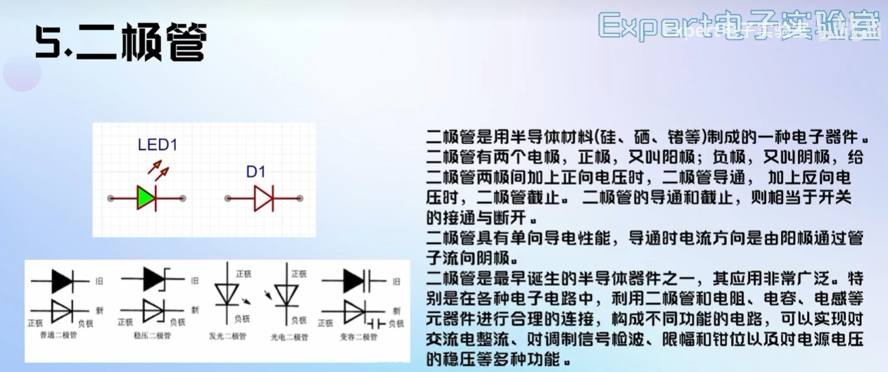
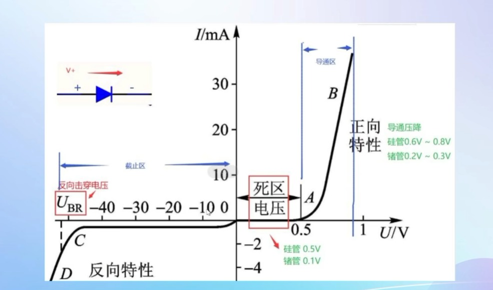
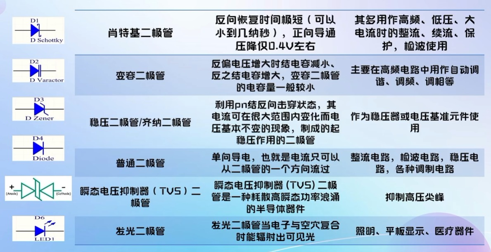
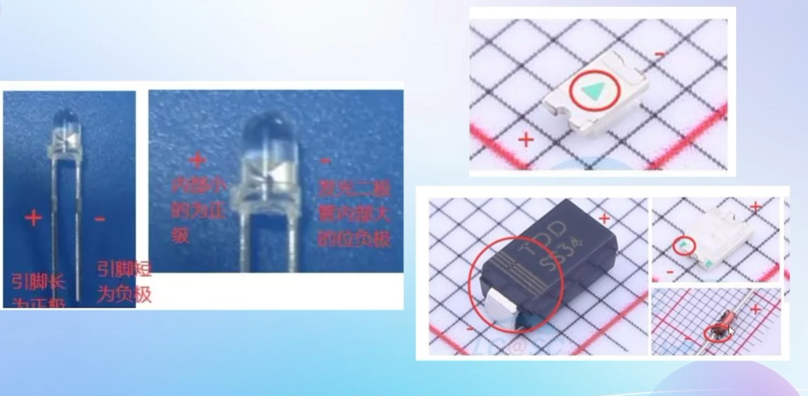
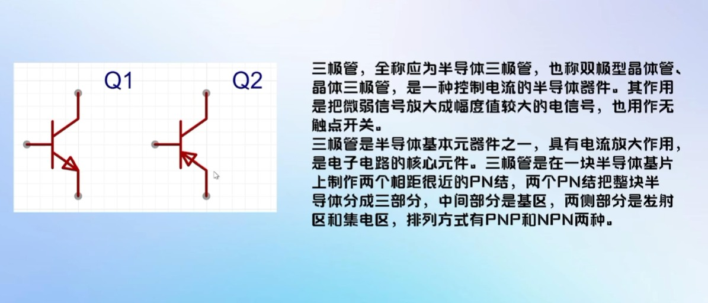
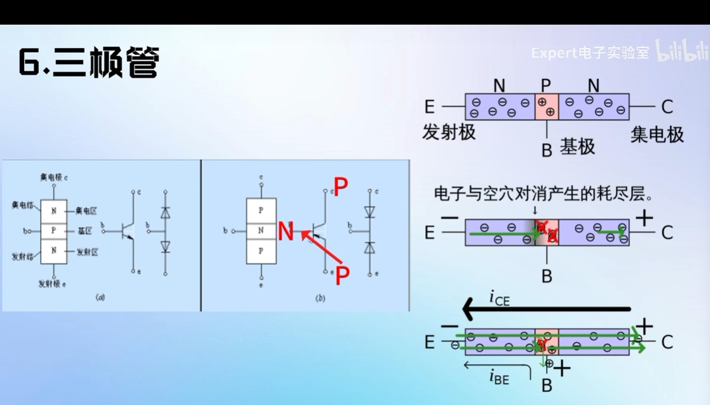
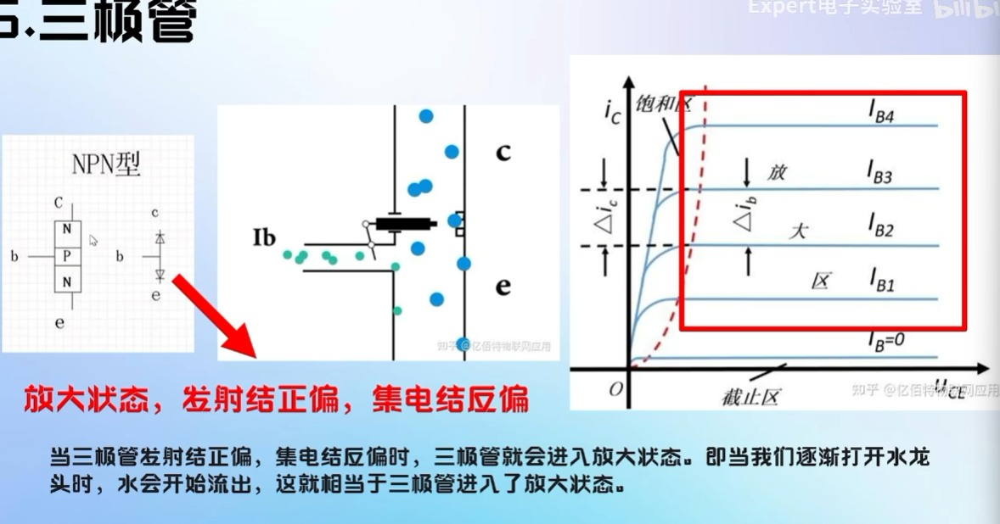
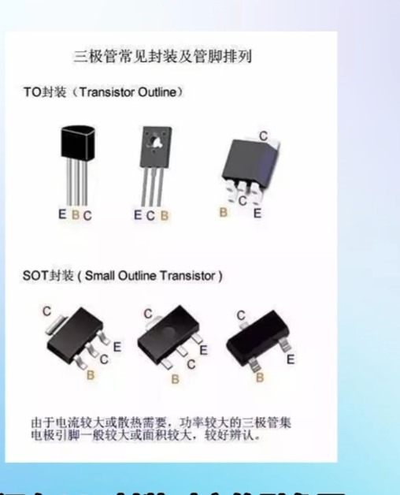
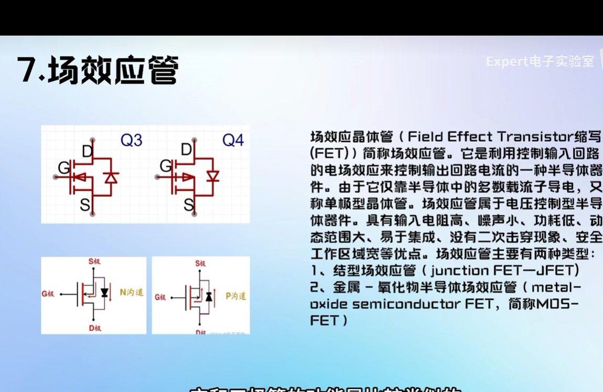

2026-10-4
#####说实话我感觉没啥用这笔记，不如手写笔记有印象

# 二极管

这几个二极管需要记下来：

### 区分二级管正负：长脚为正，有绿色点方向为负，有竖线的方向为负

-----

# 三极管

#### 区分NPN型与PNP三极管

左边的箭头由P到N，所以是NPN; 右边同理。为PNP

PN结具有单向导电性

- IB=0,截至状态，发射结（e发射极和b基极组成的PN结）反偏，集电结c集电极和b基极组成的PN结）反偏；

- ic=kiB，Ube>下面那个二极管的开启电压；放大状态；，发射结正偏，集电结反偏；

- 饱和状态，发射结正偏，集电结反偏；此时三极管相当于开关使用

  ​

  #### 封装

  

  ​

-----

## 场效应管（MOS管）

- 三极管为电流控制；
- MOS管为电压控制；

