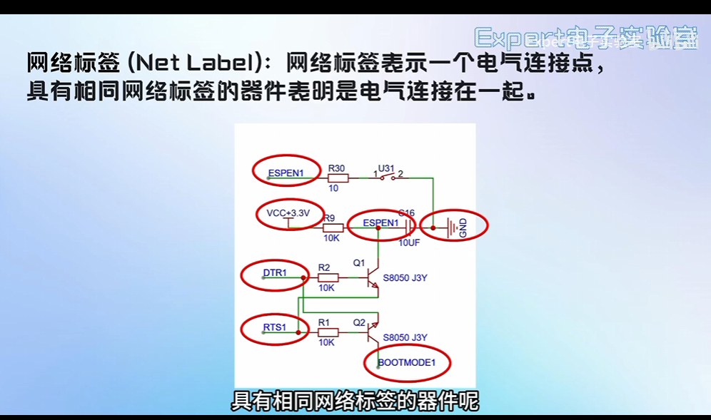
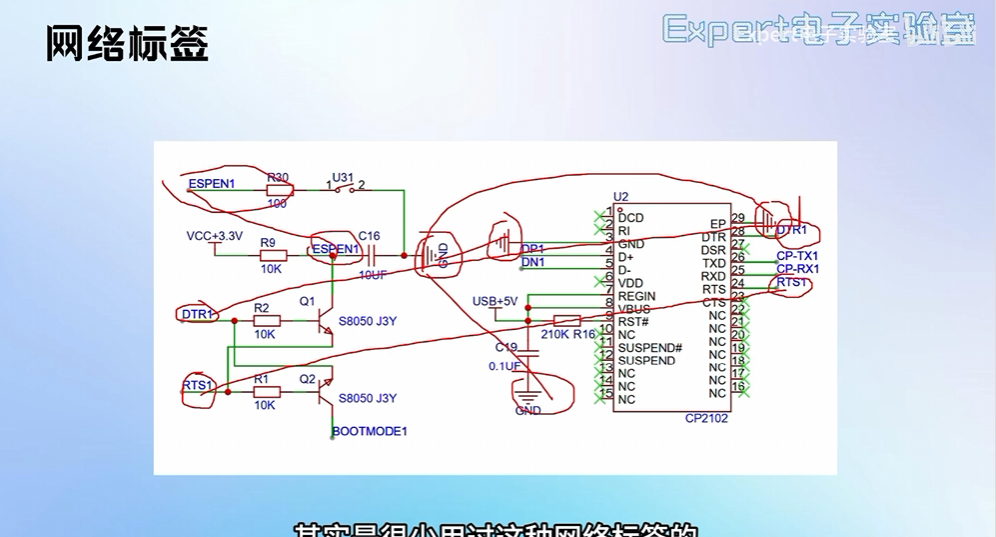
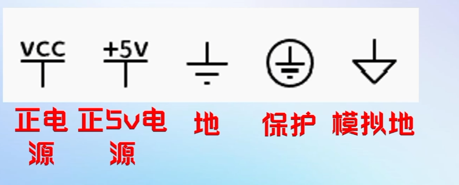
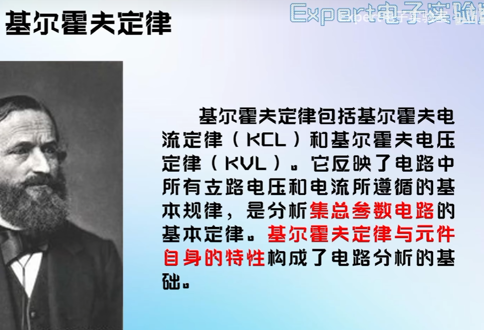
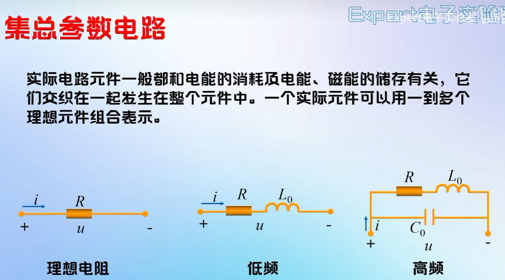
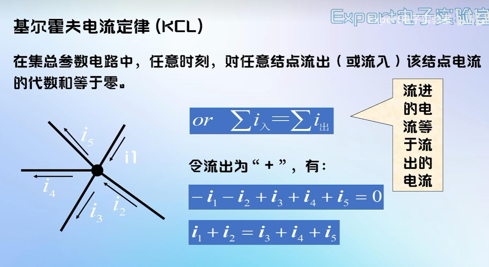
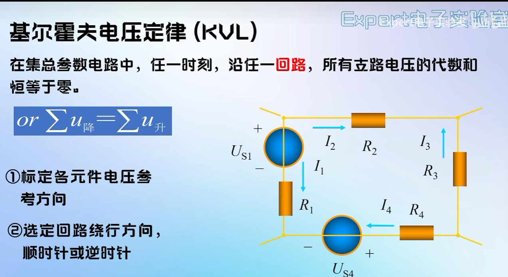

# 2026-10-5电路定理

#### 网络标签：

- 同一个网络标签的是连在一起的

- 支路
- 回路
- 独立回路
- 网孔：不可再分的回路；对平面电路,其内部不含任何
  支路的回路称网孔。电路中的
  网孔数等于独立回路数。

- 

- #### 理想化:假定这些现象可以分别研究,并且这些电磁过程都分别集中在各元件内部进行,这样的元件称为集总参数元件。

- #### 用集总参数电路模型来近似地描述实际电路是有条件的,它要求实际电路的尺寸要远小于电路工作时电磁波的波长。在高频的情况下，就不能用集总参数模型来近似等效了

  ### 基尔霍夫电流定(KCL)

- 

- 推广:KCL可以应用于电路中包围多个结点的任一闭合面,

- ### 基尔霍夫电流定律的实质:

  - 1KCL是电荷守恒和电流连续性原理在电路中任意结点处的反映
  - 2KCL表示结点支路电流间的约束,与支路上的元件性质无关;
  - 3KCL方程是按电流参考方问列写的,与电流的实际方问无关。

### 基尔霍夫电压定律（KVL）

- 

- ### 基尔霍夫电压定律(KVL)

  - 1KVL的实质应映了电路遵从能量守恒定律;
  - 2KVL表示回路中的支路电压的约束,与回路中各支路上接的元件性质无关;
  - 3KVL方程是按电压参考方问列写,与电压实际方问无关.

  ### 电路定理小结：

  - 1KCL是对结点中支路电流的线性约束,用于约束结点中各支路电流,或立路中各元件的电流。
  - 2KVL是对回路电压的线性约束,用于约束回路中各立路电压,或回路中各元件的电压。
  - 3KCL、KVL与组成支路的元件性质及参数无关。
  - 4KCL只能约束电流,不能约束电压;KVL只能约束电压,不能约束电流。
  - 5 KCL、KVL只适用于集总参数的电路。

  #### 用基尔霍夫定律的前提是集总参数电路

  -----

  #### 标注

- NC：no connect默认不连接

- NF: no fix 默认不安装

- 0R:是一个0R的电阻，可以进行短路

-----

#### 读懂原理图：

