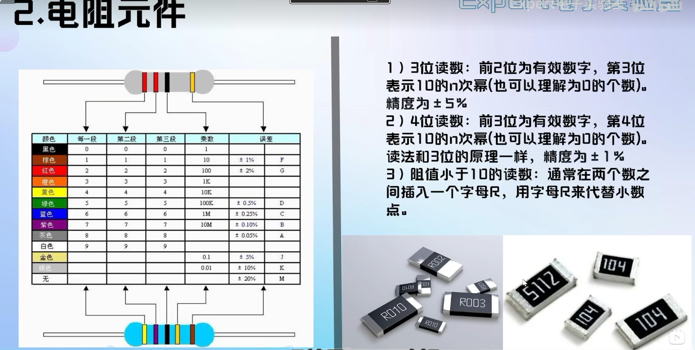
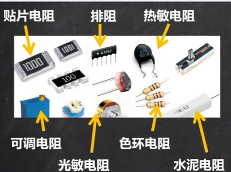
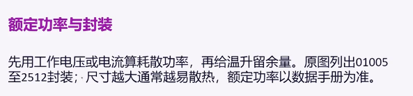
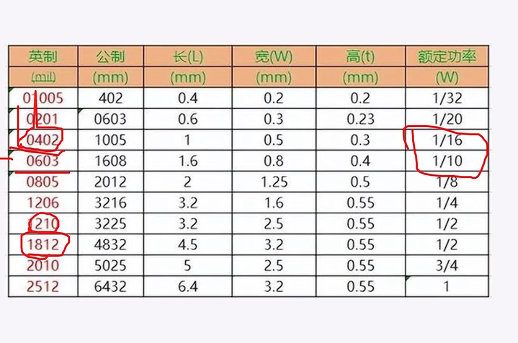
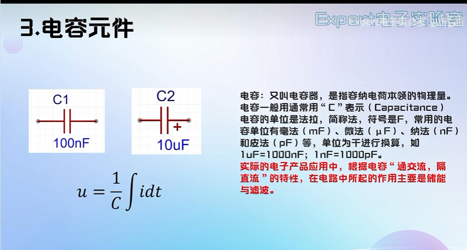
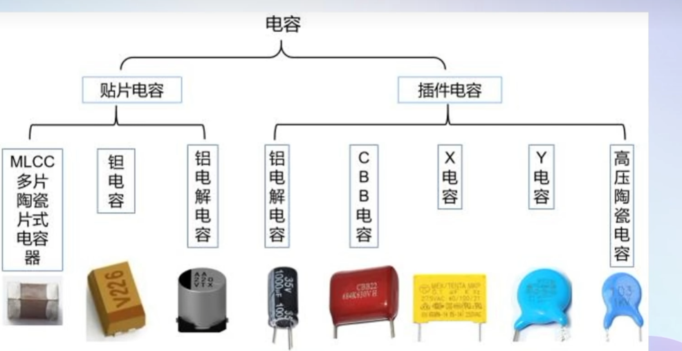
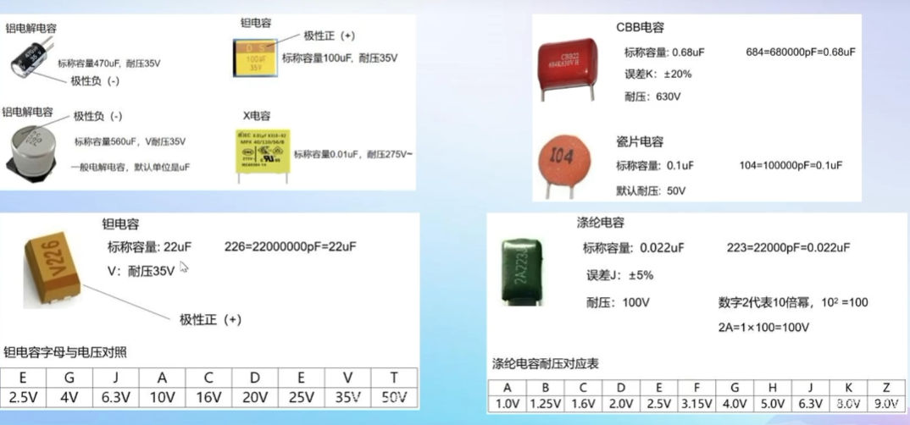
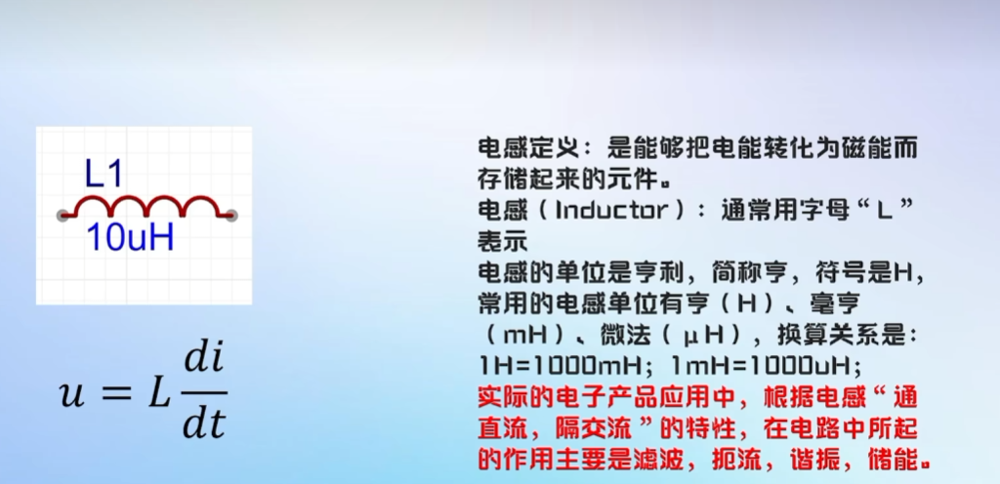
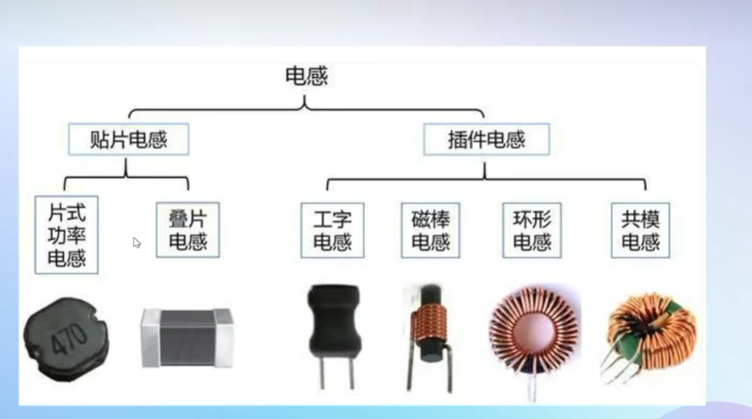
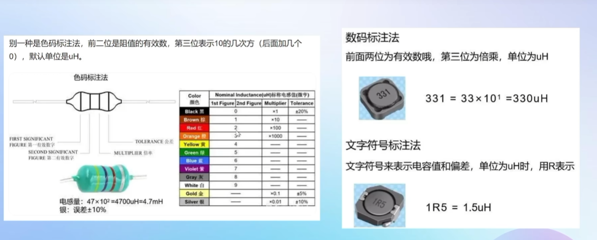

## 电阻读数

 

#### eg:

- 104=10*10^4=100k;精度为5%
- 5112=511*10^2=51.1K;精度为1%
- R010=0.01；R003=0.003;

#### 电导:G=1/R

#### 热敏电阻：

- NTC随温度升高而降低，可用于测温

- PTC随温度升高而升高，可用于过流保护

电阻太小，电流过大，容易烧；

---

## 电容

注:关联参考方向是指当电流的参考方向与电压的参考方向一致时,
则把电流和电压的这种参考方向称为关联参考方向,
否则为非关联参考方向。

#### 分为贴片电容和插件电容：

- 需注意各自的电气特性
- 有的电容无极性 有的有

#### 电容的信息：

- 容值：
- 正负极性：
- 耐压（v):

#### 电容读数：

- 226=22*10^6=22000000pF=22uF;

---

### 电感元件

- #####==电感：通直流，隔交流；通低频，阻高频；==

- #####==电容：通交流，隔直流；通高频，阻低频；==

- #####==电感通低直；电容通交高；==

#### 分为贴片电感和插件电感

- 共模电感是4个引脚，其余为两个；

#### 读值

- 331=33*10^1=330uH;
- 1R5=1.5uH;